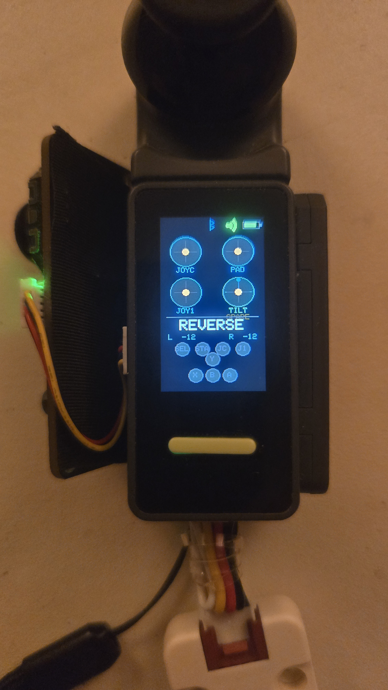

# Nesso_base



Arduino firmware for the **Arduino Nesso N1** handheld controller — a WiFi-enabled base station that drives a remote robot platform over a selectable wireless link (WiFi-UDP/TCP, BLE, LoRa). Features a 240×135px TFT display with a multi-mode menu, battery monitoring, 1–3 stick gamepad input (Adafruit seesaw, M5Stack Mini JoyC HAT, and/or an M5Stack Grove joystick unit), IR and 433 MHz RF remote control, RFID card scanning, and a web-based file manager.

## Table of Contents

- [Hardware Requirements](#hardware-requirements)
- [Build & Flash](#build--flash)
- [Python Scripts](#python-scripts)
- [Menu System](#menu-system)
- [Speaker Hat 2](#speaker-hat-2-max98357a)
- [IR Remote System](#ir-remote-system)
- [RF433 Remote System](#rf433-remote-system)
- [RFID2 Unit](#rfid2-unit)
- [Web File Manager](#web-file-manager)
- [Robot Control](#robot-control)
- [Serial Command Reference](#serial-command-reference)
- [Network Configuration](#network-configuration)

---

## Hardware Requirements

- **Arduino Nesso N1** board (ESP32-C6)
- Optional accessories (GROVE PORT.CUSTOM, SDA=GPIO 5 / SCL=GPIO 4):
  - M5Stack IR Unit (U002) — IR remote learn/transmit
  - M5Stack RF433T + RF433R units (Y-cable) — 433 MHz remote learn/transmit
  - M5Stack RFID2 Unit (WS1850S) — ISO/IEC 14443-A card scanning
  - M5Stack Unit JoyStick2 (STM32G030, I2C `0x63`) — joystick for robot control (shares the GROVE port with the units above, so one at a time)
  - M5Stack Unit Joystick v1.1 (MEGA8A, I2C `0x52`) — the original joystick unit; same GROVE port, different address
- Optional HATs (HAT bus, SDA=GPIO 6 / SCL=GPIO 7):
  - M5Stack Speaker Hat 2 (MAX98357A) — high-quality I2S audio output
  - M5StickC Mini JoyC HAT (STM32F030, I2C `0x54`) — front-mounted joystick for robot control
- Optional controller:
  - Adafruit seesaw mini gamepad (I2C `0x50`, main Wire) — stick + 6 buttons

The joysticks live on separate I2C buses (main / HAT / Grove), so up to **three** can be connected at once for multi-stick control — plus the board's built-in BMI270 IMU, which can act as a fourth "tilt stick". The two Grove units share one port, so normally you pick one of them.

**Required libraries:** `Adafruit seesaw`, `Arduino_Nesso_N1`, `MFRC522_I2C` (for RFID2), `NessoLink` (control-frame codec — install from the Arduino IDE Library Manager / `arduino-cli lib install NessoLink`, or clone [github.com/ugursayar/NessoLink](https://github.com/ugursayar/NessoLink) into your Arduino `libraries/` folder)

---

## Build & Flash

All firmware lives in `Nesso_base.ino`. WiFi credentials go in `arduino_secrets.h` (copy from `arduino_secrets.h.example`).

### Compile

```powershell
arduino-cli compile --fqbn "esp32:esp32:arduino_nesso_n1" --build-path "D:/Nesso_base/build" Nesso_base.ino
```

> `--build-path` is required with arduino-cli v1.x — without it, a caching bug in v1.4.1 corrupts the ESP32 BLE library archive, causing a linker error.

### Upload firmware

```powershell
arduino-cli upload --fqbn "esp32:esp32:arduino_nesso_n1" --port COM3 --build-path "D:/Nesso_base/build" Nesso_base.ino
```

### Build & flash LittleFS image

The `data/` directory is the LittleFS filesystem root. Rebuild and reflash the image after adding or changing files under `data/`.

```powershell
# Build image (size matches the spiffs partition: 0x9E0000 bytes)
& "D:\packages\arduino\data\packages\esp32\tools\mklittlefs\4.0.2-db0513a\mklittlefs.exe" `
    -c data -b 4096 -p 256 -s 0x9E0000 littlefs.bin

# Flash image to spiffs partition offset 0x610000
& "D:\packages\arduino\data\packages\esp32\tools\esptool_py\5.2.0\esptool.exe" `
    --chip esp32c6 --port COM3 --baud 460800 write_flash 0x610000 littlefs.bin
```

Adjust `COM3` to the actual port shown in Device Manager. The LittleFS flash step is only needed when `data/` contents change; firmware uploads do not touch it.

### Partition layout

| Name   | Offset   | Size     | Notes               |
|--------|----------|----------|---------------------|
| nvs    | 0x9000   | 0x5000   | NVS key-value store |
| app0   | 0x10000  | 0x300000 | Firmware (OTA slot 0) |
| app1   | 0x310000 | 0x300000 | Firmware (OTA slot 1) |
| spiffs | 0x610000 | 0x9E0000 | LittleFS data       |

### Arduino IDE (alternative)

1. Install the **Nesso N1 board support package**
2. Install required libraries: `Adafruit seesaw`, `Arduino_Nesso_N1`
3. Select the Nesso N1 board, set baud to **115200**
4. Compile & Upload

To enable debug output, change `#define DEBUG 0` to `#define DEBUG 1` near the top of `Nesso_base.ino`.

---

## Python Scripts

All scripts run with standard Python 3. Only `nesso_terminal.py` requires a third-party package.

### `build_littlefs.py` — build (and optionally flash) the LittleFS image

Copies a hardcoded list of files from the full `data/irdb/` library into a temporary staging directory, then runs `mklittlefs` to produce `littlefs.bin`.

```powershell
python build_littlefs.py           # build littlefs.bin only
python build_littlefs.py --flash   # build + flash to COM3
```

Edit the `INCLUDE_FILES` list at the top of the script to add or remove files. Paths are relative to `data/` (the LittleFS root), e.g.:

```
"irdb/TV/Samsung/Samsung_BN59-01315B.ir"
```

### `gen_irdb_all.py` — download the full IR file library

The full `data/irdb/` library (2795 `.ir` files) is **committed to the repo**, so you only need this script to refresh or extend it. It downloads `.ir` files from **Flipper-IRDB** (`Lucaslhm/Flipper-IRDB`) into `data/irdb/<Type>/<Brand>/<Model>.ir`. Existing files are never overwritten, so the script is safe to re-run.

```powershell
python gen_irdb_all.py
```

> The full library (~2800 files, ~9.9 MB) exceeds the 9.87 MB LittleFS partition. Use `build_littlefs.py` to create a curated image. Files not in the image can be pushed to the device at any time with the `fs upload` serial command.

### `nesso_terminal.py` — BLE UART terminal

A PC-side terminal that connects to the Nesso N1 over Bluetooth (Nordic UART Service) instead of USB.

```powershell
pip install bleak
python nesso_terminal.py
```

Once connected, all serial commands work identically over BLE.

### Legacy scripts (`gen_irdb.py` / `gen_irdb2–5.py`)

These scripts generate C header files from IR CSV data and are no longer used by the firmware. Kept for reference only — use `gen_irdb_all.py` instead.

---

## Menu System

Navigate with **KEY1** (forward) and **KEY2** (backward), 500 ms debounce. **Long-press KEY1** opens the settings overlay for the current screen.

| Mode | Description |
|------|-------------|
| `FUNCTION_MAIN` | Clock + WiFi status via NTP (UTC+3) |
| `FUNCTION_CONTROLLER` | Gamepad / Mini JoyC / tilt → robot commands over selectable link (UDP/BLE/TCP/LoRa) |
| `FUNCTION_SENSOR` | On-board BMI270 IMU — attitude indicator, pitch/roll/yaw, raw accel + gyro |
| `FUNCTION_BT` | Bluetooth scanner |
| `FUNCTION_WIFI` | WiFi network scanner |
| `FUNCTION_LORA` | LoRa / Meshtastic |
| `FUNCTION_RFID2` | M5Stack RFID2 Unit — hidden when unit not connected |
| `FUNCTION_IR` | IR remote control |
| `FUNCTION_RF433` | 433 MHz RF remote — disabled by default, enable in device settings |
| `FUNCTION_MEDIA` | Matrix rain / Vader / Obi-Wan |
| `FUNCTION_BATTERY` | Battery status + device settings |

**Device settings** (long-press KEY1 on battery screen): DIM TIMEOUT, SLEEP TIMEOUT, LOW BAT SLEEP, UI CLICKS, RF433, SPEAKER, VOLUME, RESET.

---

## Sensor screen (BMI270 IMU)

The board's 6-axis Bosch BMI270 drives screen auto-rotation, and the **Sensor** screen exposes the rest of it: an attitude indicator (horizon line that rolls and pitches, plus a tilt bubble), pitch / roll / yaw-rate / |a| readouts, and signed bars for the raw accelerometer and gyroscope X/Y/Z.

- **Tap** anywhere → zero the attitude to however you're holding it right now.
- **Long-press KEY1** → settings: `ZERO HERE`, `LEVEL REF` (back to flat/screen-up), `GYRO ZERO` (re-bias the gyro — keep the device still), `TILT STK`, `IMU TX`.

Pitch and roll are measured as rotation away from the zero reference rather than as absolute tilt, so you can calibrate in whatever posture you actually hold the device. The reference is not saved across reboots — it starts at "flat, screen up", which makes the readings true attitude until you zero it.

**Calibration refuses if the device is moving.** Both the attitude zero and the gyro bias check that the device is at rest first and change nothing if it isn't, rather than baking a wrong constant in for the rest of the session. Hold it still and retry; the serial commands say so explicitly. Gyro bias is re-measured on every boot (it drifts with temperature) and is never saved.

`CALIBRATE` on the Controller screen calibrates **everything connected** in one action — Mini JoyC centre to STM32 flash, seesaw centre re-armed, IMU attitude + gyro zeroed. `ctrl calibrate` does the same and prints what it did.

There is **no magnetometer** on this board, so there is no compass heading: yaw is a *rate* (deg/s), and integrating it drifts.

Serial: `imu` (full snapshot), `imu zero`, `imu level`, `imu debug on|off`.

---

## Speaker Hat 2 (MAX98357A)

Enable from Battery screen → long-press KEY1 → **SPEAKER**. When enabled, all audio routes through the I2S amplifier instead of the onboard buzzer. Set volume with the **VOLUME** item (25 / 50 / 75 / 100 %, default 75 %).

**HAT port wiring:**

| Signal | GPIO | Notes |
|--------|------|-------|
| BCLK   | GPIO 7 (G7) | Bit clock |
| LRCLK  | GPIO 6 (G6) | Word select |
| DATA   | GPIO 2 (G2) | Serial data |

**Features over buzzer:**
- Sine wave synthesis — smooth, musical tones
- 5 ms attack/release envelopes — no click artifacts
- Vader March and Obi-Wan theme at full audio quality
- Boot chime: three-note C major arpeggio (C5–E5–G5) at startup

**NVS keys:** `spkOn` (bool), `spkVol` (uint8 1–4)

---

## IR Remote System

IR device files (`.ir` format) are stored in LittleFS under `/irdb/` and scanned at boot. The UI is two levels:

1. **File list** — scrollable directory browser; tap a file to open the remote
2. **Remote** — contextual button layout; tap a button to transmit, swipe vertically to scroll

The active device persists across reboots (NVS key `irSel2`). Tap the title bar to return to the file list.

### Button layout

Buttons are auto-classified by label and arranged in a fixed priority order:

```
┌──────────────────────────┐
│         Power            │  full-width · red
├─────────────┬────────────┤
│   Vol  +    │   Chan +   │  half each · green/blue
├─────────────┼────────────┤
│   Vol  -    │   Chan -   │
├─────────────┴────────────┤
│           Mute           │  full-width
├──────────────────────────┤
│       ▲  Up              │
│ ◀ Left │  OK  │ Right ▶  │  D-pad cross
│       ▼  Down            │
├──────────────────────────┤
│   Menu    │    Home      │  half each · cyan
├──────────────────────────┤
│  ◀◀  │  ▶⏸  │  ▶▶       │  third-width · amber
├──────────────────────────┤
│  7   │   8   │   9       │
│  4   │   5   │   6       │  numpad · grey
│  1   │   2   │   3       │
│        0                 │
├──────────────────────────┤
│ Source   │   Input       │  generic catch-all
└──────────────────────────┘
```

Groups with no matching buttons are omitted. The D-pad maintains its + shape even when some directions are absent.

### File formats

Two `.ir` formats are supported:

**Parsed** (`type: parsed`) — uses `protocol:`, `address:`, `command:` fields.
Supported protocols: `NEC`, `SAMSUNG`/`SAMSUNG32`, `SIRC12`/`SIRC15`/`SIRC20`, `RC5`, `RC6`, `LG`, `JVC`.

**Raw** (`type: raw`) — uses a `data:` field with microsecond timings. Only the first frame is used. Raw signals are sent 3× with 45 ms spacing (Sony repeat requirement).

Address and command values are **little-endian hex bytes**, e.g. `address: 30 00 00 00` → `0x00000030`.

### Adding IR files

**Over serial (no reflash):**
```
fs mkdir /irdb/Soundbars/Sony
fs upload /irdb/Soundbars/Sony/MyRemote.ir
<paste file contents>
---END---
```

**Via full reflash:** drop `.ir` files under `data/irdb/`, then run `build_littlefs.py --flash`.

**Via learn mode:** capture signals from any physical remote using the M5Stack IR Unit (see below).

### IR Learn Mode (M5Stack IR Unit)

The **M5Stack IR Unit (U002)** plugs into the GROVE PORT.CUSTOM and provides a 38 kHz demodulated IR receiver.

| GROVE signal | GPIO | Direction |
|---|---|---|
| G4 (IR_RX) | GPIO 4 | input — demodulated receive |
| G5 (IR_TX) | GPIO 5 | output — M5 unit transmitter |

**Custom remote workflow:**

```
ir custom new Living Room   # creates /irdb/Custom/Living_Room.ir
ir learn start              # powers GROVE, arms receiver (amber dot blinks)
<point remote at M5 unit, press Power>
# serial prints: Captured: NEC  addr=0x0020  cmd=0x08
ir learn bind Power         # saves button
ir learn bind Vol+          # capture and bind more buttons
ir learn stop               # cuts GROVE power
```

**Settings overlay** (long-press KEY1 in IR screen): NEW REMOTE, SELECT REMOTE, DEL REMOTE, CAPTURE BUTTON, AUTO BIND, DELETE BUTTON, RESET.

**Touch-to-bind:** while learn mode is active and a signal is captured (green `BIND` indicator), tapping an existing button rebinds it to the captured signal.

**Auto-bind:** AUTO BIND mode auto-names captures as Btn_01, Btn_02, … without requiring a `bind` command.

**Delete mode:** pulsing red `DEL` dot in title bar — tap any button to remove it from the custom remote.

### IR serial commands

| Command | Description |
|---|---|
| `ir list` | Print all scanned `.ir` files (`*` = currently loaded) |
| `ir select <N>` | Load device N and open the remote UI |
| `ir send <N> <label>` | Load device N and send the named button |
| `ir custom new [name]` | Create a new custom remote |
| `ir custom list` | List all custom remotes |
| `ir rename <new name>` | Rename the currently loaded custom remote |
| `ir del` | Delete the currently loaded remote file |
| `ir reload` | Re-scan `/irdb/` without reboot |
| `ir pin` | Show IR TX / RX GPIO numbers |
| `ir btn del <label>` | Delete a button from the loaded custom remote |
| `ir btn rename <old> <new>` | Rename a button in the loaded custom remote |
| `ir learn start` | Power GROVE and arm M5 IR Unit receiver |
| `ir learn stop` | Stop capture, cut GROVE power |
| `ir learn bind <label>` | Bind last captured signal to a button label |
| `ir learn show` | Print details of the last captured signal |

---

## RF433 Remote System

433 MHz OOK ASK remote control using M5Stack RF433T (SYN115) and RF433R (SYN531R) on a Y-cable.

**RF433 is disabled by default.** Enable from Battery screen → long-press KEY1 → **RF433**, or via `rf433 enable` serial command.

**GROVE wiring:**

| GROVE signal | GPIO | Module |
|---|---|---|
| G4 (Yellow) | GPIO 4 | RF433R — demodulated RX |
| G5 (White) | GPIO 5 | RF433T — TX data input |

### File format

Custom remotes are saved as `.sub` files in `/rf433db/Custom/`:

```
Filetype: Nesso SubGhz Remote
Version: 1
Frequency: 433920000
#
name: Button1
type: raw
RAW_Data: 450 -1350 450 -450 1350 -450 ...
```

`RAW_Data` values follow Flipper SubGhz convention: positive = HIGH pulse (µs), negative = LOW pulse.

### Learn workflow

```
rf433 custom new Garage      # creates /rf433db/Custom/Garage.sub
rf433 learn start            # drives TX LOW, powers GROVE, arms receiver
<press button on physical remote>
# serial prints: [RF433] Captured: 512 pulses T=300us
rf433 learn bind Open        # saves button
rf433 learn stop             # cuts GROVE power
```

**Auto-bind** (UI): Long-press KEY1 → RF433 settings → AUTO BIND. Captures auto-named Btn_01, Btn_02, … with a 2-second pause between captures.

**Touch-to-bind:** while learn mode is active, tap an existing button to rebind it to the last captured signal.

### RF433 serial commands

| Command | Description |
|---|---|
| `rf433 list` | List all scanned `.sub` / `.433` files |
| `rf433 select <N>` | Load remote N and open UI |
| `rf433 send <N> <label>` | Transmit button from remote N |
| `rf433 custom new [name]` | Create new custom remote |
| `rf433 custom list` | List custom remotes |
| `rf433 rename <new name>` | Rename the loaded custom remote file |
| `rf433 del` | Delete the currently loaded remote file |
| `rf433 reload` | Re-scan `/rf433db/` |
| `rf433 btn del <label>` | Delete a button from the loaded custom remote |
| `rf433 btn rename <old> <new>` | Rename a button in the loaded custom remote |
| `rf433 learn start` | Drive TX LOW, power GROVE, arm receiver |
| `rf433 learn stop` | Stop capture, cut GROVE power |
| `rf433 learn bind <label>` | Bind last capture to button label |
| `rf433 learn show` | Print last captured signal info |
| `rf433 enable` | Enable RF433 function |
| `rf433 disable` | Disable RF433 function |

---

## RFID2 Unit

The **M5Stack RFID2 Unit (WS1850S)** reads ISO/IEC 14443-A cards (MIFARE Classic, Ultralight, NTAG, etc.) over I2C. Scanned UIDs are saved to `.rfid` files under `/rfid2db/`.

The RFID2 screen is hidden from navigation when the unit is not connected. Connecting after boot is supported — no reboot needed.

**GROVE PORT.CUSTOM wiring:**

| GROVE signal | GPIO | Direction |
|---|---|---|
| Yellow (SDA) | GPIO 5 | I2C data |
| Gray (SCL) | GPIO 4 | I2C clock |

**I2C address:** 0x28 | **Library:** `MFRC522_I2C` v1.0.0

### UI levels

| Level | Description |
|---|---|
| Main | NFC icon + "WAITING…"; shows UID + card type for 3 s after a read. Blinking `REC` dot in record mode. |
| File list | Scrollable browser of `.rfid` files. Tap a file to open its card list. Tap title bar to return to Main. |
| Card list | Cards stored in the loaded file. In delete mode, tapping a card removes it immediately. |

Long-press KEY1 opens the settings overlay: NEW FILE, VIEW FILES, DEL FILE, RECORD CARD, DELETE CARD, RESET.

### Record mode

When active, every new card tap is auto-saved to the loaded file as `Card_01`, `Card_02`, … Enable via the settings overlay or `rfid2 record start`.

### `.rfid` file format

```
Filetype: Nesso RFID Database
Version: 1
#
name: Card_01
uid: E3:ED:B5:19
sak: 08
type: MIFARE 1KB
```

Each card block is separated by `#`. Fields: `name` (up to 23 chars), `uid` (hex colon-separated), `sak` (hex byte), `type`.

### RFID2 serial commands

| Command | Description |
|---|---|
| `rfid2 list` | List all `.rfid` files (`*` = currently loaded) |
| `rfid2 reload` | Re-scan `/rfid2db/` without reboot |
| `rfid2 select <N>` | Load file N and open RFID screen |
| `rfid2 new [name]` | Create new `.rfid` file and start record mode |
| `rfid2 del` | Delete the currently loaded file |
| `rfid2 rename <new name>` | Rename the loaded file |
| `rfid2 card list` | List cards in the loaded file |
| `rfid2 card del <label>` | Delete a card by label or UID |
| `rfid2 card rename <old> <new>` | Rename a card |
| `rfid2 record start` | Start auto-saving scanned cards |
| `rfid2 record stop` | Stop record mode |
| `rfid2 scan` | I2C bus scan on GROVE port |
| `rfid2 probe` | Probe address 0x28 and update availability flag |

---

## Web File Manager

A browser-based file manager starts automatically when WiFi connects (port 80). Navigate to `http://<device-ip>/` in any browser. Type `webfm` in the serial terminal to print the current URL.

| Feature | How to use |
|---|---|
| Browse | Click folders; use breadcrumb or `..` row to go up |
| Upload | Click **↑ Upload**; supports multiple files at once |
| Download | Click **dl** next to any file |
| Delete | Click **del** — directories must be empty |
| New folder | Click **+ Folder** |
| Rename/move | Click a file row to select it, type new name, click **Rename** |

Uploading or deleting `.ir` files auto-triggers a rescan of `/irdb/`.

---

## Robot Control

Controller mode reads a joystick and transmits motor + button commands to a remote robot over a selectable wireless link.

- **Forward/back** (vertical stick) → both motors same power
- **Turn** (horizontal stick) → motors opposite (rotation)

### Supported controllers

| Controller | Bus | Notes |
|---|---|---|
| Adafruit seesaw mini gamepad | I2C `0x50` (main Wire) | Stick + A/B/X/Y/SELECT/START |
| M5Stack Mini JoyC HAT (STM32F030) | I2C `0x54` (HAT bus, GPIO 6/7) | Stick + button; self-powered |
| M5Stack Unit JoyStick2 (STM32G030) | I2C `0x63` (GROVE bus, GPIO 5/4) | Stick + button; GROVE 5V powered |
| M5Stack Unit Joystick v1.1 (MEGA8A) | I2C `0x52` (GROVE bus, GPIO 5/4) | Stick + button; GROVE 5V powered. Raw ADC — the centre is captured on entry / by CALIBRATE. Slow to wake on a cold rail, so the first few frames after entering the Controller screen read centred |
| Built-in BMI270 IMU ("tilt stick") | on-board | Tilt the device itself; no button. **On by default** — disable with `TILT STK` |

The joysticks use three separate connectors (main / HAT / Grove), so **three can be plugged in
at once** — plus the IMU, giving **four live devices**, which is exactly what the frame carries
(drive + three aux). A *fourth physical* stick needs a Grove I2C hub: JoyStick2 and Joystick
v1.1 have different addresses and both work, but with five devices connected the lowest-ranked
one holds no role — `ctrl order` tells you which. Two conflicts worth knowing: the Mini JoyC
HAT and the Speaker Hat 2 use the same pins (GPIO 6/7), and a Grove joystick occupies the Grove
port, so it can't share with RFID2 / IR / RF433.

- **1 device** → it drives the motors directly.
- **2 devices** → one drives, the other is an **aux** stick (camera/turret → `auxX`/`auxY`).
- **3 devices** → one drives + **two** aux sticks (`aux2X`/`aux2Y` rides in a v2 frame).
- **4 devices** → one drives + **three** aux. The third aux needs `AUX3 TX` on (v4 frame);
  until then it is live on screen but marked **SPARE** and not transmitted.

### Device order

The order is fully configurable — not just "who drives". It's a stored ranking of every
supported device, and the roles **DRIVE / AUX 1 / AUX 2 / AUX 3** are handed out top-down over
whichever devices are actually connected. There are four roles, so a fifth connected device
takes none.

- On screen: one settings row per role. KEY1 cycles which connected device holds it.
- Serial: `ctrl order` to see it, `ctrl order tilt,pad` to set it (any subset — the rest keep
  their relative order), or `ctrl drive|aux1|aux2|aux3 <dev>` for a single role.
  Device names: `pad` (seesaw), `joyc` (Mini JoyC), `joy2` (JoyStick2), `joy1` (Joystick v1.1),
  `tilt` (IMU).

Unplugging a device doesn't rewrite your order — it just takes no role until it's back, and
then returns to exactly the slot you gave it. `ctrl order` prints absent devices in lowercase.
Changing the drive device (by reordering, unplugging or hot-plugging) sends an explicit stop
before the new stick takes over, so the robot never jumps from the old stick's last command
straight to the new stick's resting position.

The Controller screen shows one disc per role — **two rows in portrait, four across in
landscape**. The Mini JoyC, both Grove units and the tilt stick always follow screen rotation; the seesaw
follows it only in attached `MOUNT` modes (see below). With `SCR LOCK` on (the default) the
screen doesn't rotate while you're on the Controller screen, so "screen rotation" there means
the orientation you navigated in with.

### Profiles

Save the whole controller setup under a name and switch between rigs or robots in one tap.
A profile stores the device order, axis flags, deadzone, seesaw mount, tilt range/enable,
IMU TX, AUX3 TX, the transport **and** the robot's IP/ports — so "switch to my other robot"
is a single action. Things that belong to the handheld rather than the robot (screen lock,
HID mode, the LoRa scanner's radio preset) stay global.

- **PROFILE** row — cycles `DEFAULT` → your profiles → `DEFAULT`, applying immediately.
  A `*` means the live settings differ from the saved profile; APPLY writes them back.
- **PROFILES** row — browser with each saved profile plus **`+ NEW (CLONE)`**, which saves
  the settings you're using right now as a new profile.
- Serial: `ctrl prof`, `ctrl prof new <name>`, `ctrl prof use <name>`, `ctrl prof save`,
  `ctrl prof del <name>`, `ctrl prof default`.

Up to 8 profiles, stored as JSON under `/ctrldb/` (visible in the web file manager). Names are
1–12 characters of `A–Z a–z 0–9 _ -`. There's no on-device rename or delete — this device has
no text entry, and the only long-press available means APPLY, which is a bad thing to bind a
destructive action to; use serial or the web file manager. The active profile is restored on
boot; if its file has gone, your settings are left exactly as they were and the profile
reverts to `DEFAULT`.

### Tilt stick (IMU)

The board's own IMU counts as a stick and is **on by default** (`TILT STK`, or `ctrl tilt on|off`) — it's soldered to the board, so it's simply always one of the sticks you have. With two joysticks plugged in you get three discs: drive, aux1, and `TILT`. Gesture: **tilt the top of the device down/away to go forward, drop the right edge to turn right.** `TILT RNG` sets how far you have to tilt for full deflection (15 / 25 / 35 / 45°, default 25).

The tilt disc shows **three** axes where a joystick disc shows two — a horizon line that rolls and slides with attitude, and a yaw needle on the rim (straight up = not turning, swinging clockwise for clockwise rotation). The orange bubble is the actual post-deadzone stick deflection, same as every other disc.

Because the IMU takes a slot, on a two-joystick setup it lands in **aux2** and frames go from v1 to v2. Any NessoLink ≥ 1.1.0 receiver decodes that fine, but if your robot already acts on `aux2X`/`aux2Y` it will now see them move with device tilt — turn `TILT STK` off if that's not what you want.

Because tilt is measured from a *zero reference* rather than from level, you can hold the device however you like — `CALIBRATE` (or a tap on the Sensor screen, or `imu zero`) captures the current hold as centre. Until you calibrate explicitly, the controller screen re-zeros to your current hold every time you enter it, so walking in holding the device at a reading angle never lurches the robot. The tilt axis enforces a deadzone floor of ~1.5° regardless of the `DEADZONE` setting, because a hand has no mechanical centre to spring back to and the residual counts would otherwise make the robot creep instead of stop.

Best results holding the device roughly flat-to-moderately-tilted. Held bolt upright, roll becomes unobservable (rotating about the gravity vector is invisible to an accelerometer, and there's no magnetometer to fall back on).

### Wire protocol — RemoteFrame (v1 / v2 / v3)

Every link sends the same little-endian frame, encoded by the shared **[NessoLink](https://github.com/ugursayar/NessoLink)** library (`nessoEncode()`); the robot receiver decodes it with the same library (`nessoDecode()`). Magic + version + CRC let it validate. There are three versions — the firmware sends the **minimal** one and `nessoDecode()` accepts all of them, so existing receivers keep working for setups that don't use the newer fields:

- **v1 (15 bytes)** — drive + up to one aux stick. Sent unless a third stick or IMU data is present.
- **v2 (19 bytes)** — adds a second aux stick (`aux2X`/`aux2Y`). Sent in three-joystick mode.
- **v3 (25 bytes)** — adds the transmitter's IMU attitude. Sent only when `IMU TX` is on.
- **v4 (29 bytes)** — adds a third aux stick. Sent only when `AUX3 TX` is on.

| off | field | type | notes |
|---|---|---|---|
| 0 | magic | u8 | `0xA5` |
| 1 | version | u8 | `1`, `2` or `3` |
| 2 | seq | u8 | rolling sequence (dedup / loss detection) |
| 3–4 | leftMotor | i16 | −255..255 |
| 5–6 | rightMotor | i16 | −255..255 |
| 7–8 | auxX | i16 | aux stick 1 X (0 unless aux present) |
| 9–10 | auxY | i16 | aux stick 1 Y |
| 11–12 | buttons | u16 | bitfield, 1 = pressed: A=0, B=1, X=2, Y=3, SELECT=4, START=5, STICK=6, STICK2=7 |
| 13 | flags | u8 | bit0 = aux1, bit1 = aux2, bit2 = IMU present |
| 14 | crc8 (v1) | u8 | poly `0x07`, init `0x00`, over bytes 0..13 — **v1 ends here** |
| 14–17 | aux2X / aux2Y (v2+) | i16×2 | aux stick 2 X/Y (zero-filled if no second aux stick) |
| 18 | crc8 (v2) | u8 | poly `0x07`, init `0x00`, over bytes 0..17 — **v2 ends here** |
| 18–19 | imuPitch (v3) | i16 | −255..255, + = nose up |
| 20–21 | imuRoll (v3) | i16 | −255..255, + = right side down |
| 22–23 | imuYaw (v3) | i16 | −255..255, **rate** not angle, + = clockwise from the front |
| 24 | crc8 (v3) | u8 | poly `0x07`, init `0x00`, over bytes 0..23 |
| 24–25 | aux3X (v4) | i16 | aux stick 3 X (0 unless `hasAux3`) |
| 26–27 | aux3Y (v4) | i16 | aux stick 3 Y |
| 28 | crc8 (v4) | u8 | poly `0x07`, init `0x00`, over bytes 0..27 |

Every axis — motors, aux and IMU — is −255..255, so a receiver needs exactly one dead-zone constant. IMU counts convert back to physical units with `nessoImuDeg()` (±255 = ±90°) and `nessoImuYawDps()` (±255 = ±250 °/s).

Aux slots are **role-typed, not device-typed** — which stick sits in a slot is your configuration, so write receivers against "aux slot 2", never "the Mini JoyC". Button bits *are* device-bound and don't move when you reorder. A tilt input in an aux slot rides as stick deflection; attitude only ever appears in the `imu*` fields.

> **`IMU TX` and `AUX3 TX` are off by default on purpose.** Each promotes *every* frame to a newer version (v3 / v4), and a receiver built against an older NessoLink rejects unknown version bytes. It fails closed rather than misparsing — but the **all-stop travels the same path**, so a rejected version means the robot never hears the stop. Nothing auto-promotes the wire version when you plug a stick in. Re-vendor `NessoFrame.h` on the robot (NessoLink ≥ 1.2.0 for v3, ≥ 1.3.0 for v4) before turning either on. They also cost airtime on LoRa, which is already duty-cycle limited.

Sent continuously at ~10 Hz (even when centered) so the receiver can implement a failsafe (stop motors if no valid frame for N ms).

### Stopping

Two things guarantee the robot stops, so a receiver failsafe is a backstop rather than the primary mechanism:

- **Releasing the stick** mixes to `L=0, R=0`, and frames keep flowing at ~10 Hz — so the stop is transmitted immediately and repeatedly. The rest-position deadzone (all three sticks) is what makes a released stick read as *exactly* zero rather than a small non-zero creep.
- **An explicit all-stop** (motors 0, aux centred, buttons cleared) is transmitted whenever the controller stops driving: navigating away from the Controller screen, opening its settings panel, or losing the drive stick. It's re-sent until the transport confirms the frame went out (bounded attempts, so it can't stall a screen change), since a single dropped stop would leave the robot running.

> **Note for autonomous robots:** the all-stop is a *command*, not a disable. A receiver that falls back to autonomous behaviour when the remote link goes quiet will stop on the frame, then resume autonomously once its own remote-timeout expires. That's the receiver's arbitration policy to decide, not something the controller can express in a v1/v2 frame.

### Transport links (`TX LINK`)

| Link | Status | Notes |
|---|---|---|
| **WiFi-UDP** | default | to `robot_ip:udp_port` (8889); lowest latency, same LAN |
| **BLE** | working | notifies the NESSO BLE UART characteristic; needs a connected central (WiFi contends — one radio) |
| **WiFi-TCP** | minimal | lazy connect to `robot_ip:tcp_port` (8890) |
| **LoRa** | working (low-rate) | async (non-blocking) via NessoLink; the SX1262 is shared with the LoRa scanner, so it's armed on demand (`loraTxArm()`) and the two screens hand the radio back and forth. SF11/BW250 + EU868 ~1% duty cycle cap it at a few Hz — a command link, not live driving. Matching receiver: the NessoLink **`CardputerAdvLoRaReceiver`** example (M5 Cardputer ADV + Cap LoRa 1262) |

### Configuration

Open controller settings with **long-press KEY1**, or use the `ctrl …` serial commands. All settings persist to NVS.

| Setting | Options |
|---|---|
| **CALIBRATE** | One tap, every connected device. Mini JoyC: write center to its STM32 flash · seesaw and Joystick v1.1: re-capture centre on next read · JoyStick2: self-centres (no manual cal) · tilt stick: re-zero attitude + gyro bias |
| **DEADZONE** | Rest-position deadzone applied to **all** sticks: 8 / 16 / 30 / 50 |
| **SWAP XY / INVERT X / INVERT Y** | drive-stick axis transforms |
| **TX LINK** | wireless link (table above) |
| **SCR LOCK** | **ON (default)** — the Controller *and* Sensor screens hold the orientation you entered them in, so tilting never rotates the display or the axis mapping mid-drive or mid-reading · OFF — normal auto-rotation. The same row appears on the Sensor settings panel |
| **MOUNT** (seesaw) | `SIDE` / `BACK` — attached, follows screen rotation · `DET-PORT` / `DET-LAND` — detached, fixed to the stick |
| **PRIMARY** (2+ sticks) | which stick drives: `PAD` / `JOYC` / `JOY2` (cycles connected sticks) |

---

## Serial Command Reference

Connect at **115200 baud**. Commands work over both USB serial and BLE UART (`nesso_terminal.py`). Type `help` on the device for the full list.

### Navigation / General

| Command | Description |
|---|---|
| `help` | Print full command reference |
| `status` | Current state summary (screen, WiFi, BT, BLE-UART) |
| `next` | Advance to next screen (same as KEY1) |
| `prev` | Go to previous screen (same as KEY2) |
| `goto <screen>` | Jump to screen: `main`, `controller`, `sensor`, `bt`, `wifi`, `lora`, `rfid2`, `ir`, `rf433`, `media`, `matrix`, `vader`, `obiwan`, `battery` |
| `clock` | Print current date/time (NTP) |
| `battery` | Print voltage, percentage, charge state, uptime |
| `webfm` | Print web file manager URL |
| `i2c` | Scan all three I2C buses (main / HAT / GROVE) and list responders — handy for checking joystick/unit detection |
| `heap` | Free / minimum-ever / largest-block heap, plus the sprite backing store and size |

### Controller (`ctrl`)

| Command | Description |
|---|---|
| `controller` | Print joystick position + last motor values |
| `send <L> <R>` | Send a motor command directly (−255..255) |
| `ctrl` | Show device, axis flags, link, screen lock, mount, primary |
| `ctrl invertx on\|off` | Invert turn (X) axis |
| `ctrl inverty on\|off` | Invert forward/back (Y) axis |
| `ctrl swap on\|off` | Swap X/Y |
| `ctrl dz 0-3` | Stick deadzone, all sticks (8 / 16 / 30 / 50) |
| `ctrl calibrate` | Calibrate **every** connected input at once, and report per device |
| `ctrl link udp\|ble\|tcp\|lora` | Select wireless link |
| `ctrl order` | Show the device order and the roles it resolves to |
| `ctrl order <list>` | Set the order, e.g. `ctrl order tilt,pad` (any subset, best first) |
| `ctrl drive\|aux1\|aux2\|aux3 <dev>` | Put one device in one role (`pad\|joyc\|joy2\|joy1\|tilt`) |
| `ctrl aux3tx on\|off` | Send the 3rd aux stick — v4 frame, needs a NessoLink 1.3.0+ receiver (default `off`) |
| `ctrl prof` | List profiles and show the active one |
| `ctrl prof new\|use\|del <name>` | Create from current settings / switch to / delete |
| `ctrl prof save` | Write the current settings back to the active profile |
| `ctrl prof default` | Clear the active profile (settings unchanged) |
| `ctrl primary pad\|joyc\|joy2\|joy1\|tilt` | Alias for `ctrl drive` |
| `ctrl ssmount 0-3` | Seesaw mount: `side`/`back` (attached) · `detport`/`detland` (detached) |
| `ctrl lock on\|off` | Screen lock — hold the screen orientation while on the Controller or Sensor screen (default `on`) |
| `ctrl tilt on\|off` | Use the built-in IMU as a tilt stick (default `on`) |
| `ctrl tiltrange 0-3` | Tilt for full deflection: 15 / 25 / 35 / 45 degrees |
| `ctrl imutx on\|off` | Send IMU attitude in the frame — promotes it to v3, needs a NessoLink 1.2.0+ receiver (default `off`) |

### IMU (`imu`)

| Command | Description |
|---|---|
| `imu` | Accel + gyro + derived attitude snapshot, and what the tilt stick / frame are sending |
| `imu zero` | Zero the attitude to the current hold and re-bias the gyro |
| `imu level` | Reset the attitude reference to level (flat, screen up) |
| `imu debug on\|off` | Stream readings every 300 ms |

### Filesystem (`fs`)

| Command | Description |
|---|---|
| `fs info` | LittleFS total / used / free bytes |
| `fs ls [path]` | List directory contents (default `/`) |
| `fs cat <path>` | Print file contents |
| `fs rm <path>` | Delete a file |
| `fs mkdir <path>` | Create a directory (parent must exist) |
| `fs mv <src> <dst>` | Rename or move a file |
| `fs upload <path>` | Upload a text file — paste content then send `---END---` on its own line |

**Upload example:**
```
fs mkdir /irdb/Soundbars/Sony
fs upload /irdb/Soundbars/Sony/MyRemote.ir
<paste file contents>
---END---
```

After any `fs rm`, `fs mv`, or `fs upload` of a `.ir` file, `/irdb` is automatically rescanned.

---

## Network Configuration

| Setting | Value |
|---|---|
| UDP target | `192.168.1.27:8889` (config.json `robot_ip` / `udp_port`) |
| TCP target | `192.168.1.27:8890` (config.json `robot_ip` / `tcp_port`) |
| NTP server | `pool.ntp.org` |
| Timezone offset | UTC+3 (10800 s) |

WiFi credentials are stored in `arduino_secrets.h` (`SECRET_SSID`, `SECRET_PASS`). Copy `arduino_secrets.h.example` and fill in your credentials.
